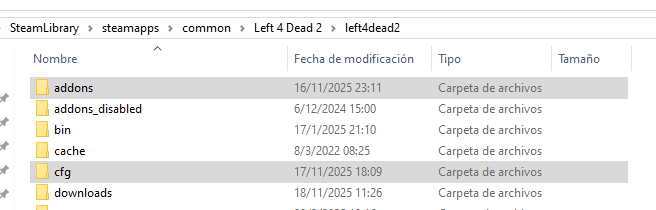
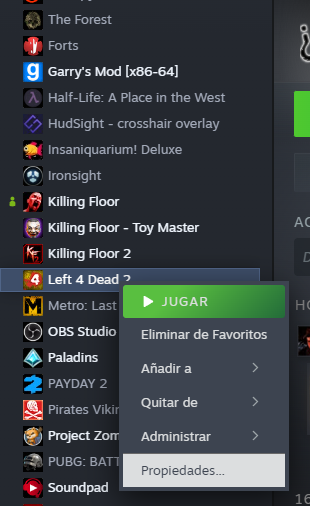
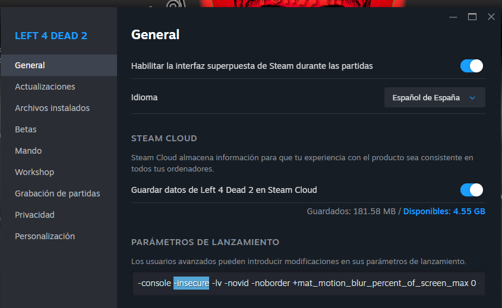
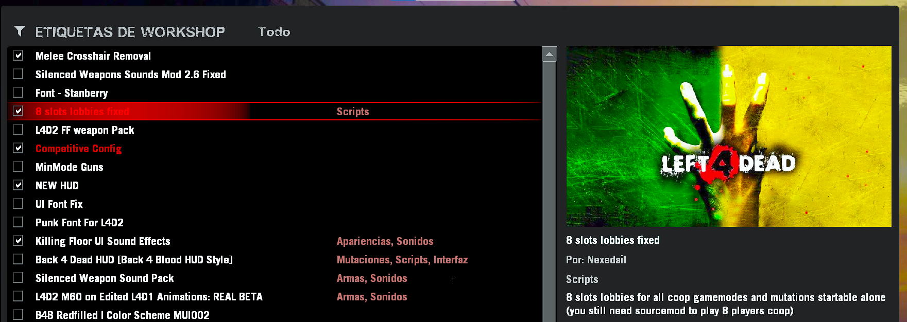

1. Copia las carpetas **Addons** y **CFG**

---

2. Pégalas en la ruta:  
**TuDisco:\SteamLibrary\steamapps\common\Left 4 Dead 2\left4dead2**

- Si te pregunta si deseas reemplazar un archivo, acepta.  
  *(Solo se reemplazará **listenserver.cfg**, no te preocupes.)*

---

3. Ve a tu **Biblioteca de Steam** y busca **Left 4 Dead 2**.  
- Haz clic derecho en el juego y selecciona **Propiedades**.

---

4. En la sección **GENERAL**, agrega el parámetro **-insecure**.  
   *(El parámetro **-console** es recomendado, pero no obligatorio.)*

- Si no sabes qué es la consola, te recomiendo ver un video; puede ayudarte muchísimo.

---

5. Entra al juego y ve a **Extras > Addons**.  
- Marca o desmarca **8 Player Lobby** según prefieras.

---

6. ¡Hostea un servidor local y disfruta!  
No olvides revisar el:

👉 **[Manual de uso](manual.md)**