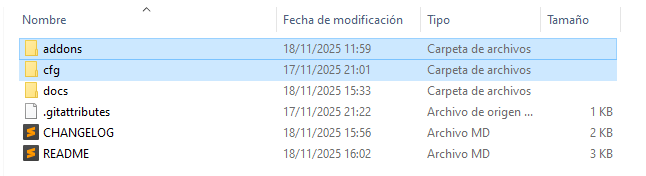

1. Copy Addons and CFG folders

2. Paste them in YourDisk:\SteamLibrary\steamapps\common\Left 4 Dead 2\left4dead2
- If it says to replace a file, then do so. (only listenserver.cfg will be replaced, don't worry)

3. Go to your Steam Games Library and find your Left 4 Dead 2.
- Right Click on it, and find properities.

4. Then, go to GENERAL, and paste -insecure as a parameter, -console is also recommended but not mandatory.
- If you don't know what console is, then i suggest watching a video about it, it can help you with many things.

5. Join a server, and go to extras > Addons.
- Disable 8 Player Lobby if you desire.

6. Host a local server and enjoy! Remember to see
- 👉 [Manual de uso](docs/manual.md)