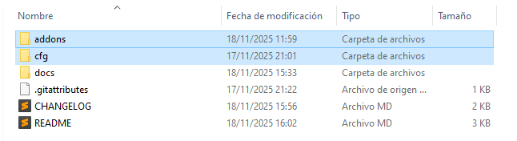
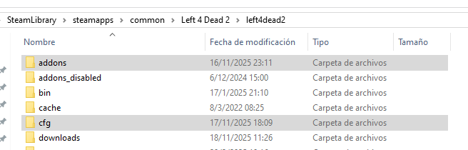
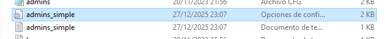
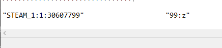
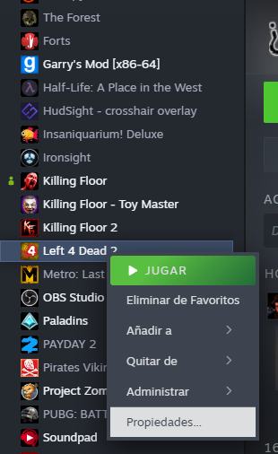
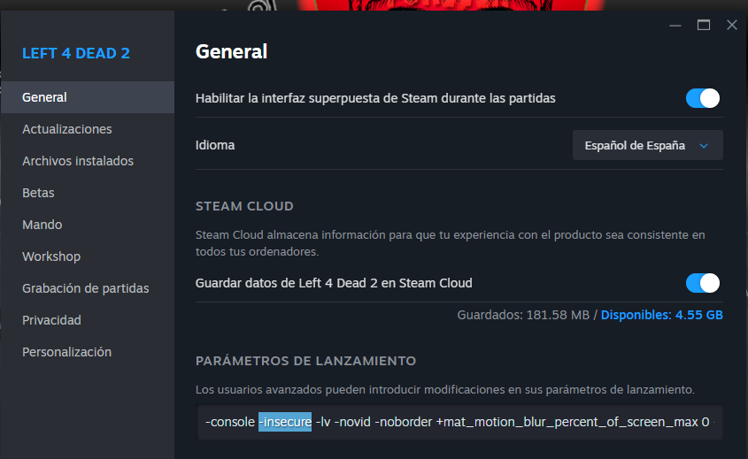
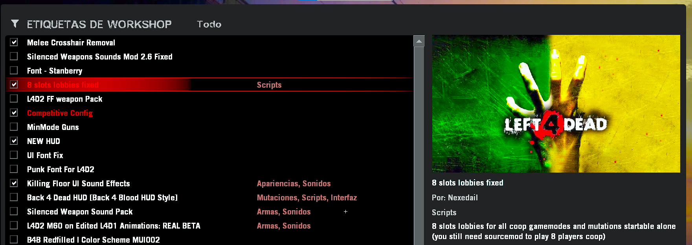

1. Copia las carpetas **Addons** y **CFG** (El resto de archivos puedes removerlos si deseas).



---

2. Pégalas en la ruta:  
**TuDisco:\SteamLibrary\steamapps\common\Left 4 Dead 2\left4dead2**

- Si te pregunta si deseas reemplazar un archivo, acepta.  
  *(Solo se reemplazará **listenserver.cfg**, no te preocupes.)*



---

3. (OPCIONAL) Añádete a ti o a otras personas como administradores del servidor.

- Dirígete a la ruta:
  **TuDisco:\SteamLibrary\steamapps\common\Left 4 Dead 2\left4dead2\addons\sourcemod\configs**

- Busca el archivo **admins_simple.ini**, ábrelo y desplázate hasta el final del archivo.



- Obtén tu **STEAMID** desde cualquiera de estos sitios:

  - [steamid.xyz](https://steamid.xyz/)
  - [steamid.io](https://steamid.io/)
  - [steamid.pro](https://steamid.pro/)

- Agrega una línea como esta al final del archivo:

```ini
"STEAM_1:1:30607799"    "99:z"
```

- Debería de quedarte algo como esto, si te quedo así, entonces guardalo y listo!



---

4. Ve a tu **Biblioteca de Steam** y busca **Left 4 Dead 2**.  
- Haz clic derecho en el juego y selecciona **Propiedades**.



---

5. En la sección **GENERAL**, agrega el parámetro **-insecure**.  
   *(El parámetro **-console** es recomendado, pero no obligatorio.)*

- Si no sabes qué es la consola, te recomiendo ver un video; puede ayudarte muchísimo.



---

6. Entra al juego y ve a **Extras > Addons**.  
- Marca o desmarca **8 Player Lobby** según prefieras.



---

7. ¡Hostea un servidor local y disfruta!  
No olvides revisar el:

👉 **[Manual de uso](manual.md)**
